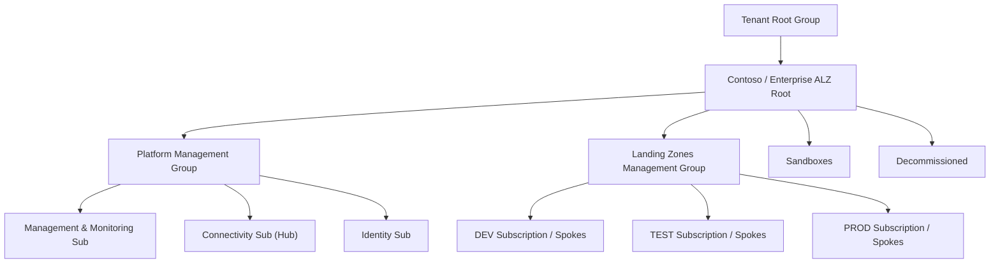

# Azure Landing Zone (Hub-Spoke Topology) — Target Architecture & Repository Design
**Capstone Project Submission for Instructor Review**
**Course / Track:** AZ-400 / Cloud DevOps & Platform Engineering  
**Author:** Candidate Platform Engineer  
**Status:** Ready for Review (Draft Phase)

---

## 1. Executive Summary & Objective

This document outlines the **Target Architecture Design** and **Repository/Module Directory Structure** for the Azure Landing Zone Capstone Project.

The objective is to implement a secure, scalable, and enterprise-grade **Hub-and-Spoke network topology** governed by Azure Policy, Management Group hierarchies, and centralized perimeter security controls (Azure Firewall, Bastion, and VPN/ER Gateway), supporting isolated workload spokes across **DEV**, **TEST**, and **PROD** environments.

---

## 2. Target Architecture Specifications

### 2.1 Governance & Management Group Hierarchy
Following the Microsoft Cloud Adoption Framework (CAF) Azure Landing Zone guidelines:



#### Azure Policy Enforcements
1. **Allowed Regions (Geofencing):** Restrict deployments strictly to approved target regions (e.g., `East US` / `Central US` / `West Europe`).
2. **Allowed Resource Types:** Prevent costly unapproved services (e.g., unauthorized GPU SKUs, unapproved public IPs on VMs).
3. **Mandatory Tagging:** Enforce tagging standard (`Environment`, `CostCenter`, `Owner`, `Project`, `IaC_Managed`).
4. **Deny Public IP on Spoke NICs:** Force all workload ingress/egress through the central Hub Firewall or Application Gateway.
5. **Enforce NSGs and UDRs:** Audit or deny subnets created without an attached Network Security Group.

---

### 2.2 Hub-and-Spoke Network Architecture

```mermaid
flowchart TB
    subgraph OnPrem ["On-Premises"]
        DC["Datacenter / Corporate Users"]
    end

    subgraph HubVNet ["HUB VNet (10.0.0.0/16)"]
        direction TB
        subgraph Gateways ["Perimeter Ingress & Access"]
            VPNGW["VPN / ExpressRoute Gateway<br/><code>10.0.1.0/24</code> (GatewaySubnet)"]
            Bastion["Azure Bastion Host<br/><code>10.0.2.0/26</code> (AzureBastionSubnet)"]
        end
        subgraph CentralFirewall ["Egress / Inspection Engine"]
            FW["Azure Firewall (Standard/Premium)<br/><code>10.0.3.0/24</code> (AzureFirewallSubnet)<br/>Private IP: 10.0.3.4"]
        end
        subgraph SharedServices ["Platform Shared Services"]
            SharedSub["Shared / DNS Resolver Subnet<br/><code>10.0.4.0/24</code>"]
        end
    end

    subgraph InternetZone ["External"]
        Internet["Internet<br/>(Filtered Egress via FW)"]
    end

    subgraph DevSpoke ["Spoke VNet — DEV (10.1.0.0/16)"]
        DevWeb["snet-dev-web (10.1.1.0/24)"]
        DevApp["snet-dev-app (10.1.2.0/24)"]
        DevData["snet-dev-data (10.1.3.0/24)"]
        DevUDR["UDR: 0.0.0.0/0 -> 10.0.3.4"]
    end

    subgraph TestSpoke ["Spoke VNet — TEST (10.2.0.0/16)"]
        TestWeb["snet-test-web (10.2.1.0/24)"]
        TestApp["snet-test-app (10.2.2.0/24)"]
        TestData["snet-test-data (10.2.3.0/24)"]
        TestUDR["UDR: 0.0.0.0/0 -> 10.0.3.4"]
    end

    subgraph ProdSpoke ["Spoke VNet — PROD (10.3.0.0/16)"]
        ProdWeb["snet-prod-web (10.3.1.0/24)"]
        ProdApp["snet-prod-app (10.3.2.0/24)"]
        ProdData["snet-prod-data (10.3.3.0/24)"]
        ProdUDR["UDR: 0.0.0.0/0 -> 10.0.3.4"]
    end

    %% Hybrid Connectivity
    DC ==>|IPsec VPN / ExpressRoute| VPNGW

    %% Hub Internal
    VPNGW --> FW
    Bastion -.->|Secure Bastion Management| DevApp
    Bastion -.->|Secure Bastion Management| TestApp
    Bastion -.->|Secure Bastion Management| ProdApp

    %% Peering Connections
    HubVNet <== "VNet Peering (Gateway Transit: Allow)" ==> DevSpoke
    HubVNet <== "VNet Peering (Gateway Transit: Allow)" ==> TestSpoke
    HubVNet <== "VNet Peering (Gateway Transit: Allow)" ==> ProdSpoke

    %% Egress
    FW ==>|NAT / Application Rules| Internet
    DevSpoke -.->|0.0.0.0/0 via UDR| FW
    TestSpoke -.->|0.0.0.0/0 via UDR| FW
    ProdSpoke -.->|0.0.0.0/0 via UDR| FW
```



---

### 2.3 IP Addressing & Subnet Allocation Plan

| Network Component | Virtual Network Name | CIDR Block | Subnets & Subnet CIDRs | Purpose |
| :--- | :--- | :--- | :--- | :--- |
| **Hub VNet** | `vnet-hub-prod-01` | `10.0.0.0/16` | • `GatewaySubnet` (`10.0.1.0/24`)<br>• `AzureBastionSubnet` (`10.0.2.0/26`)<br>• `AzureFirewallSubnet` (`10.0.3.0/24`)<br>• `AzureFirewallManagementSubnet` (`10.0.3.128/26` if Basic/Standard)<br>• `snet-shared-svc` (`10.0.4.0/24`) | Central routing, firewall egress, bastion access, hybrid cross-premises termination. |
| **Dev Spoke VNet** | `vnet-spoke-dev-01` | `10.1.0.0/16` | • `snet-web` (`10.1.1.0/24`)<br>• `snet-app` (`10.1.2.0/24`)<br>• `snet-db` (`10.1.3.0/24`)<br>• `snet-pe` (`10.1.4.0/24`) | Development tier workloads, isolated testing, rapid developer deployments. |
| **Test Spoke VNet** | `vnet-spoke-test-01` | `10.2.0.0/16` | • `snet-web` (`10.2.1.0/24`)<br>• `snet-app` (`10.2.2.0/24`)<br>• `snet-db` (`10.2.3.0/24`)<br>• `snet-pe` (`10.2.4.0/24`) | Integration testing, staging QA, pre-release performance benchmarks. |
| **Prod Spoke VNet** | `vnet-spoke-prod-01` | `10.3.0.0/16` | • `snet-web` (`10.3.1.0/24`)<br>• `snet-app` (`10.3.2.0/24`)<br>• `snet-db` (`10.3.3.0/24`)<br>• `snet-pe` (`10.3.4.0/24`) | Production-grade business critical workloads, strict SLA & zero public IP. |

---

### 2.4 Traffic Flow & Routing Topology

1. **Spoke-to-Internet Traffic (Egress Inspection):**
   - Each spoke subnet is associated with a User Defined Route (UDR) containing:
     - Route: `0.0.0.0/0` -> Next Hop: `VirtualAppliance` (`10.0.3.4` - Azure Firewall Private IP).
   - Azure Firewall applies Network & Application rules (FQDN filtering, TLS inspection) before SNATing to the Firewall Public IP.
2. **Spoke-to-Spoke Traffic (Inter-Spoke Segmentation):**
   - Spokes do NOT peer with each other directly (hub-and-spoke isolation).
   - Routing for `10.0.0.0/8` or specific spoke CIDRs points to `10.0.3.4` (Azure Firewall), enabling centralized firewall microsegmentation and IDS/IPS inspection.
3. **Inbound Administrative Access (Zero Public IP on VMs):**
   - Engineers connect via Azure Bastion (Web SSL / Azure CLI tunneling) directly to private IP endpoints.
   - On-premises operators reach internal workloads across site-to-site VPN or ExpressRoute Gateway.

---

## 3. Proposed Repository & Module Folder Structure

We adopt a **modular Terraform / OpenTofu** approach (paired with Azure DevOps YAML pipelines). The design enforces **separation of concerns**, reusable child modules, decoupled state management, and environment-specific variable layering.

```text
landingZone/
├── .github/                           # GitHub Actions CI/CD workflows (or Azure DevOps)
│   └── workflows/
│       ├── pr-validate.yml            # Linting (tflint), fmt check, security scan (tfsec/checkov)
│       ├── deploy-governance.yml      # Step 1: Deploy Management Groups & Policies
│       ├── deploy-hub.yml             # Step 2: Deploy Hub Connectivity & Firewall
│       └── deploy-spokes.yml          # Step 3: Deploy Dev/Test/Prod Spokes & Peerings
│
├── .gitignore                         # Ignore .terraform, *.tfstate, .env, secrets
├── README.md                          # Quickstart guide, onboarding, architecture overview
├── ARCHITECTURE_DESIGN_AND_REPO_STRUCTURE.md # This Capstone architectural proposal
│
├── modules/                           # Reusable, self-contained Terraform Child Modules
│   ├── management_groups/             # Enterprise CAF Management Group tree
│   │   ├── main.tf
│   │   ├── variables.tf
│   │   └── outputs.tf
│   ├── policy_assignment/             # Region, tagging, and resource type enforcement
│   │   ├── main.tf
│   │   ├── variables.tf
│   │   └── outputs.tf
│   ├── resource_group/                # Standardized RG creator with tagging
│   │   ├── main.tf
│   │   ├── variables.tf
│   │   └── outputs.tf
│   ├── vnet/                          # VNet + Subnets + Service Endpoints/Delegations
│   │   ├── main.tf
│   │   ├── variables.tf
│   │   └── outputs.tf
│   ├── nsg/                           # Network Security Groups & default rule blocks
│   │   ├── main.tf
│   │   ├── variables.tf
│   │   └── outputs.tf
│   ├── route_table/                   # UDRs for routing spoke traffic via Hub Firewall
│   │   ├── main.tf
│   │   ├── variables.tf
│   │   └── outputs.tf
│   ├── vnet_peering/                  # Bi-directional peering with transit flags
│   │   ├── main.tf
│   │   ├── variables.tf
│   │   └── outputs.tf
│   ├── azure_firewall/                # Azure Firewall, Public IP, and Firewall Policy/Rules
│   │   ├── main.tf
│   │   ├── variables.tf
│   │   └── outputs.tf
│   ├── bastion/                       # Azure Bastion Host + Public IP + diagnostic logging
│   │   ├── main.tf
│   │   ├── variables.tf
│   │   └── outputs.tf
│   └── vpn_gateway/                   # Virtual Network Gateway (VPN / ExpressRoute)
│       ├── main.tf
│       ├── variables.tf
│       └── outputs.tf
│
└── layers/                            # Root deployment layers (Decoupled state backends)
    ├── 00-governance/                 # Tier 0: Root Management Groups & Core Policies
    │   ├── backend.tf
    │   ├── main.tf
    │   ├── variables.tf
    │   ├── outputs.tf
    │   └── terraform.tfvars
    │
    ├── 01-connectivity-hub/           # Tier 1: Hub VNet, Firewall, Bastion, Gateway
    │   ├── backend.tf
    │   ├── main.tf
    │   ├── variables.tf
    │   ├── outputs.tf
    │   └── environments/
    │       └── hub.tfvars
    │
    └── 02-spokes/                     # Tier 2: Workload Spokes (DEV, TEST, PROD)
        ├── backend.tf
        ├── main.tf
        ├── variables.tf
        ├── outputs.tf
        └── environments/
            ├── dev.tfvars             # DEV spoke parameters (10.1.0.0/16)
            ├── test.tfvars            # TEST spoke parameters (10.2.0.0/16)
            └── prod.tfvars            # PROD spoke parameters (10.3.0.0/16)
```

---

## 4. Key Design Decisions & Rationale

| Area | Choice | Rationale |
| :--- | :--- | :--- |
| **State Separation** | Decoupled state files for `00-governance`, `01-connectivity-hub`, and `02-spokes` | Limits blast radius. Breaking changes in a spoke cannot accidentally corrupt or delete Hub Firewall or Management Groups. |
| **Centralized Egress** | Azure Firewall in Hub with UDR `0.0.0.0/0` in all Spokes | Absolute compliance with enterprise zero-trust. Prevents data exfiltration and provides centralized audit logging. |
| **No Inter-Spoke Peering** | Star (Hub-Spoke) topology without direct spoke-to-spoke links | Strict isolation between non-production (`DEV`, `TEST`) and production (`PROD`) environments. Spoke-to-spoke communication must be explicitly permitted through the Firewall. |
| **Bastion Jumperless Access** | Native Azure Bastion in Hub | Eliminates jumpbox VM maintenance, patch overhead, and exposed SSH/RDP ports to the public Internet. |
| **Modular Child Modules** | Single-responsibility modules in `/modules` | Promotes DRY (Don't Repeat Yourself) code, easy testing, and standardized tagging/naming policies across all environments. |

---

## 5. Phased Rollout Plan for Build Work

1. **Phase 1: Foundation & Governance (Tier 0)**
   - Initialize remote backend (Azure Storage Account + Key Vault for secrets).
   - Deploy Management Group hierarchy and assign baseline Azure Policies.
2. **Phase 2: Connectivity Hub (Tier 1)**
   - Deploy Hub VNet, GatewaySubnet, AzureFirewallSubnet, AzureBastionSubnet.
   - Deploy Azure Firewall with baseline network/application rule collections.
   - Deploy Azure Bastion and VPN/ER Gateway.
3. **Phase 3: Workload Spokes & Peering (Tier 2)**
   - Provision Dev, Test, and Prod VNets with respective subnets and NSGs.
   - Provision UDRs pointing default route `0.0.0.0/0` to Azure Firewall private IP (`10.0.3.4`).
   - Establish bi-directional VNet peering between Hub and each Spoke.
4. **Phase 4: Validation & Testing**
   - Deploy test workload VMs in DEV and PROD.
   - Validate connectivity to Internet via Azure Firewall logs.
   - Confirm inter-spoke isolation and Bastion RDP/SSH access.
